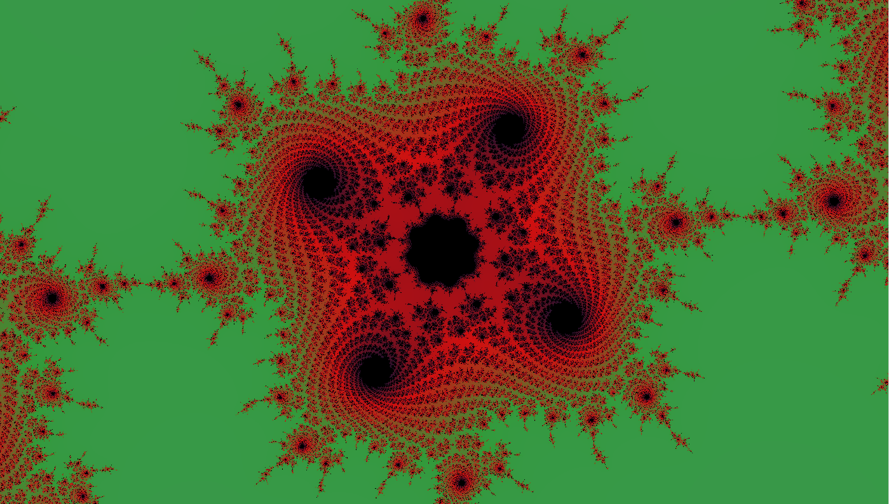
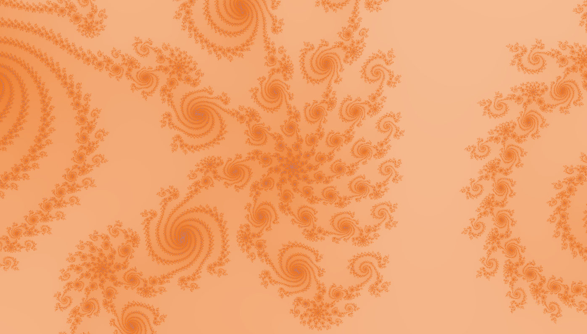
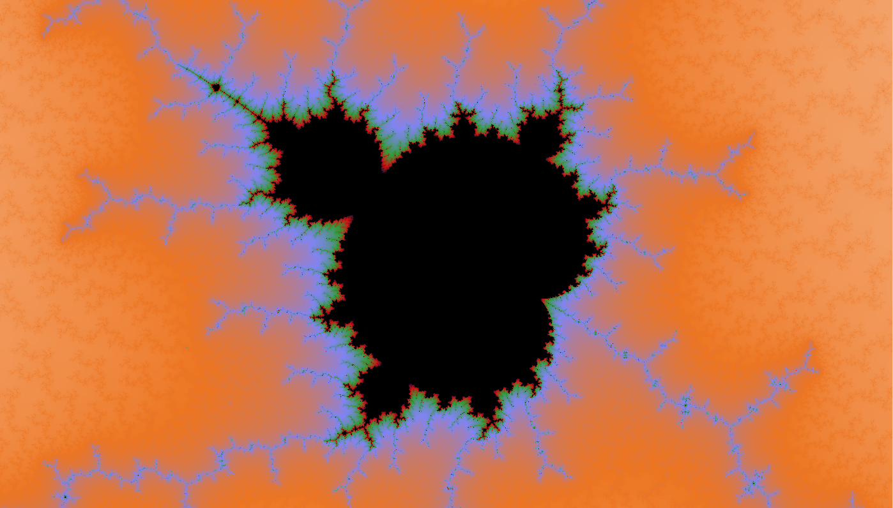

# mandelbrot
Simple interactive Mandelbrot set zoomer made using C, openGL and GLUT.

Draws images on multiple passes enhanching the level of detail in each pass for improved interactiveness.

# Usage
Build using make. Built only linux in mind, but any platform with gcc, openGL and GLUT might work, I suppose.

Run the executable. Use mouse left click to zoom in, right click to zoom out.

The width and height of the canvas (in pixels) can be set by command line options, e.g.

`./target/main --height 1080`

Providing just the height will automatically adjust the width to keep the aspect ratio and vise versa.

Other fractals besides mandelbrot are supported. An alternative fractal may be rendered by providing command line option --fractal-name, for example

`./target/main --fractal-name tan_mixture`

Currently supported are
* mandelbrot (default)
* z3
* tan_mixture
* burning_ship

# Examples

# Limitations
The precision of long double limits the depth to which you can zoom. One can zoom to scales of about e-17 or so before the image starts getting blurry. There is still plenty to look at.

# Settings
Zooming in might take couple of seconds depending on the "complexity" of the current scene. One can speed up the painting by playing with "settings.h" options and recompiling. Reducing the size of the canvas or the maximum number of iterations will significantly improve speed at the cost of image prettiness. 

